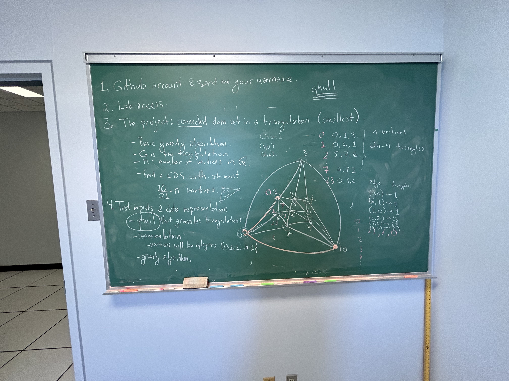
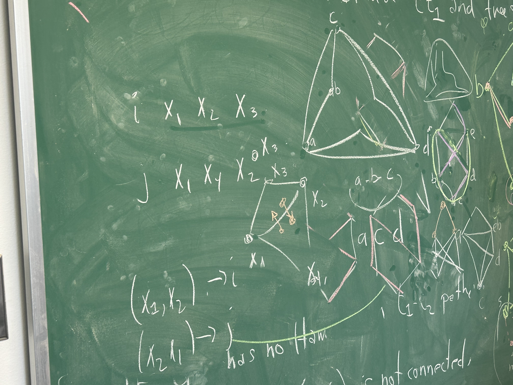
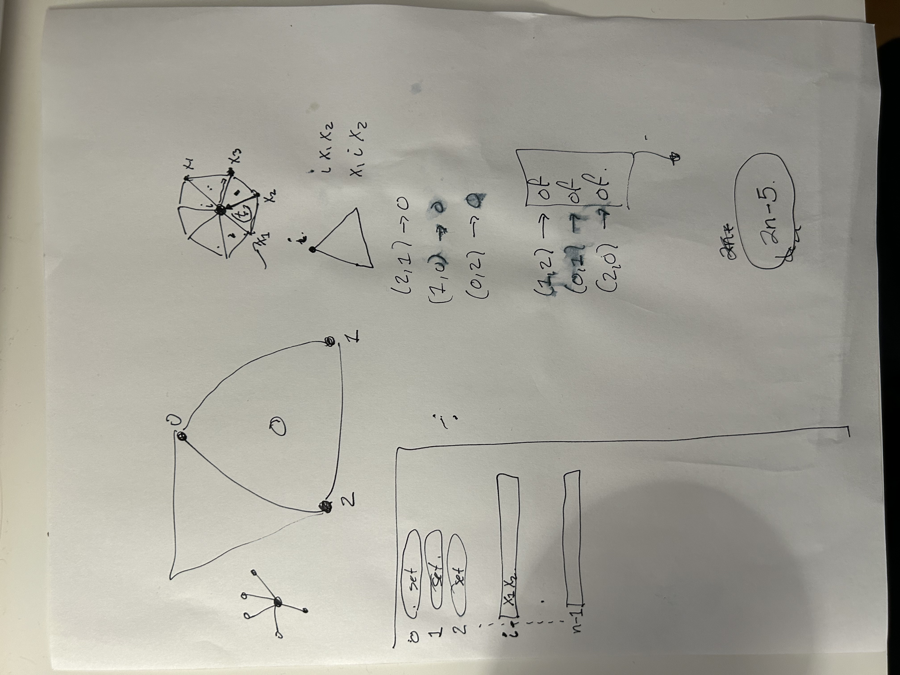

# Updates (Simon Tran)

## Updates carried out on: May 6th, 2024 (~2 hours)

Installed Qhull and setup personal local repository. Also helped Eden setup and install Qhull, Git and a simple text editor (previously she was usually Windows Notepad).

## Updates carried out on: May 7th, 2024 (~7 hours)

### Update 1: Update personal `README.md` for personal documentation

Wrote a `README.md` wth a description of the project, and an installation and usage guide. This serves as a reminder in case I forget how to setup the project.

### Update 2: Refactor CLI tool for personal understanding

- Added type hints for clarity
- Added `black` and `isort` for import formatting for consistent formatting, and `flake8` for linting
- Added crucial `plt.show()` for `matplotlib` planar graph
- Created `messages.py` to hold STDOUT messages
- Modified STDOUT messages for personal clarity
- Segmented code into distinct functions
- Renamed variables
- Modified argument parsing to use Python's standard library `argparse`. This fixes issues program crashes or unexpected behavior like when a user mistypes options, or when a user inputs a negative number of points. Also, the default positional arguments are now properly set (e.g. previously, the default of 10 points didn't work properly)

> *Remark*  
> I've written code such that functions are read like a newspaper i.e. top-down. This allows for a natural reading, and allows the reader to read higher levels of abstraction first i.e. the first few functions, and if needed, they may read more to learn the granular details i.e. the later functions

## Updates carried out on: May 8th, 2024 (~2 hours)

Complete edge to face map, ensuring the outer face edges are ordered in a counter-clockwise manner.

## Updates carried out on: May 9th, 2024

